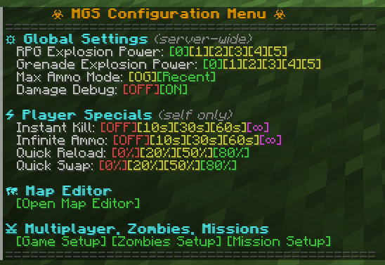
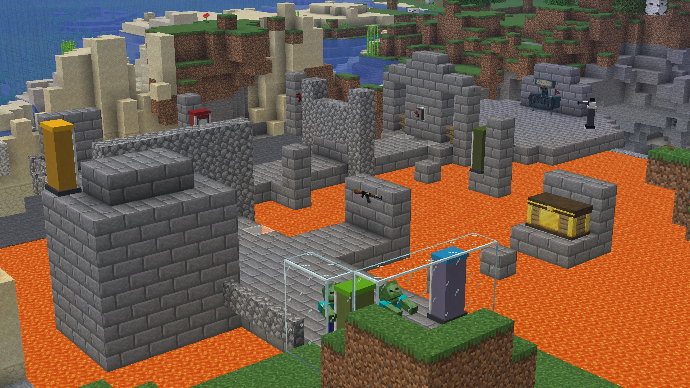

# MC Guns System

[![Powered by StewBeet](https://img.shields.io/badge/Powered%20by-StewBeet-5865F2?colorA=%23E00000&colorB=%2300A000&logo=data:image/png;base64,iVBORw0KGgoAAAANSUhEUgAAACAAAAAgCAYAAABzenr0AAAHDklEQVRYR8VWe1BcVxn/nbvvXR7lkYQi0NAspAKBJpqWxPQBU1p0Wk3UmoeSGuPYarSOMzp1tHY6Y5s/bDvTxk46WmvsVK2mgbYzjnlhSaahXWKkAUIMCSFpnRAeIQR22ce9e+/xd1mWLgyLrPmjF87sued85/t+3+/7vvNdgU/4ESnaN+VlimfmFU8VQAZyMKjYhdN21X5LJBLpmdL+fwNLCqC3u61WSJm1rKK6McGF1207sVGzKMBjxglkZdVhdHSM+wXwYL+IoF9GcV8qDCUH0Ok7462svmWWsl6xE8tEN1dvBYxn+TuInco6/ExZD6n3KULutnwL0PYsFERyAB1tPVDEPd4Vt/1nStldrk04El4pINollLuB6O8Ax6cAtYaJ8U9A5ALKLvsmHepfrwuAlFJcvHgyMzoeHoW0VHirVp8WQqRblmNM/zZV7wJcPwL0N2l4Df0dACylfD/AveOohIqu6wLQd7r9ppvLVn1oKjnb2WqUVn6OQZ98XnL8Eo+oEcA5BIRKABvJ1siR5SHASgYiT1p/Tm52XhcAk4HzXb5D3so1db2dvrfdudbN+fmfDVLpj9N/gGf85Zz9gWMxaY8yDMVAuIjvj2EUTyKXwyzVBZVr0hw41+UbK1lRnXmu472ukqq1KxI86rLsQIXezpVCjn56/igT8rcczWBA4OOwwY4zdtjvV1X13/OxMSeAvq627bqURXDhOaehbCxcftvLs5S8YS3GV51MvtAbjL3f0sb933C2x2LBbj0HD9p+gRztaWjuAffSIIKXk4GYE0Bvh6/HW1W9fMYhK+oRxdYyEn8WWELmK0xHYdXM9YNxWcdqUt/AXKCQjexoTaANF7kKxatphtq5AXS+v0u6xOMlJdXjMWnR+orIXLtNujjXMYQAxoWOQ1ZdPqcZ/gsw6rhx3JS03oTWaA3W2lbS+A9hoBR+3hyZ2O/cSBB7ZzORNAeGe301i7zVLTzwq2Mi+ycVMgthWOksY806Y63TNRUZXHkE43gL+hMqlGw4jYaMWmQHjgihrJGIruKBM2TjgG2VpmkfLBhAXJCU6+1KgXLBoHfMLNN8/OIXhBEmCEUEsVn40SwVnJcG7qSUCjxl+QIet3pZDkSt7rZtJSevLQiAlBB5eXAPDlqbNkDe+2vWWxiOKcOx6jJBEBMiNOXHNTwjJJ4lgKf53iOi8pgUwrZUQhuhkB/m9fXKXIk4OwTTXS3N6ZAb7qiQlw6fFH/GDdSRxvMKDRvMMiKcnIHZoGKCIXhBqAhJHWwEqGP5DCOIBylXdHupbG7vFQHNiNua0TkTAQg3kMfb5u2i7ExvbXlhVpOvG+Ma0EPjOoeFIVCo1IQQ5SzM1ZHJPFCxhSxsEU7skE4CcsNJyC0My3dsFty1shw9ff1XLgxfuUh8TEb0xdmYzcCprTVrylpOnRP9I2N49Ev34e/tHSj7cBgvIR1jBBBlJqjQcIXk6/xLJ6znubOPO8+LdNQz4Cc4f5UyPXnFqL9jNV5u3IfC7BuwrrRQ7jtx+mxE1aa77GwAR75bV3vnH9/1Bf3hYIf3xqK1NpvA4sJlKGt9Bz9FHj2W+Bu9PU4AbnsuupmX4x5efHayY3XDlZaNwvyb4XAY6Ov5AJcvXcZgYPR9l81aub32M+4XD7a9R+/XJWPALWAbaai93Xm4owv337OBfoQwcOkqBo8dxe9Jfj1jf5Wn84sK4EhPh0KPZSQIqQm47FbomoHgxASys7NQUFBAvhQcP+VDTXkpXms5oTJ8WTxu9pXpZE5MzniCsLfhqe2bGgrcHjf8gSCie9/Cvywabq1/gHVlwDA0lheNmycUAYV3sNVijZWHeUNEIoiEw7Cxjza+0/wRF5/geHWqgKYb1XzfhG8+vHX7eneaB9eGhrFn3+v4+ue/CMXphKIwFVmrH2sxa+Jjl8y3UDCIcDAAJ5Nw7+FDf+Hu5oWUYaJM48MN277syUjHyOAQ7A4HwqEQeL8lkDez4wqiiBUoOQ5OIEIQMQAHm7j0lVQBvPjNr23ekbNoEYYuD0ypNQmMAzDVzW75ND35LzARGIca4uWtSNnU8o/dFP5+qgDqaqvXHSpeWgxN5cWayPGUJtP8zBjG3szwBMauwdA0DI4Ow9fVeTeXj6YKgPmrjH5vy0OZY6EgPwlj3iU+if4nZAEiDFXIP4YMj1P+6cD+Acrlz2U8lq7JH5GWhlypZwx944H1MhhVhcl4LAIzbtMZOWHmSYT0e+yKbDz6rnBoag57+ugc8Zo8Nx+Ayf0lYFMCWleXV1UtLymFx8NrWY+yDGM9IU65wTUtHESAnn/U34+O830nuWd+ovETNvn34f8CkMgPGyu2cdx74+Iln3bYbB5z0zB4IUd1sNeHrl4b745Cb+ay2fl652F3eisVAAvRl7LMJw7gvxuitT/pNx5eAAAAAElFTkSuQmCC)](https://stewbeet.paralya.fr/)

Credits for resources: MGS 4.2 by TheBradqq

## 🎮 Overview

MC Guns System 26.2 is a full FPS framework for Minecraft.

It includes:

- Data-driven weapons (stats in item NBT/custom_data).
- Multiplayer game modes.
- Missions (co-op PvE).
- Zombies mode.
- A generic in-game map editor for all modes.
- A custom loadout and class ecosystem.
- Shader-based visual effects (zoom, flash, spread feedback).

Quick item commands:

- Give all registered items: `/function mgs:_give_all`
- Give one specific item: `/loot give @s loot mgs:i/<item>`

Quick config commands:

- Open player config menu: `/trigger mgs.player.config set 1`
- Open admin/server config menu: `/function mgs:config`

## 📊 Feature Matrix By Mode

| System                     | Multiplayer          | Missions                | Zombies                      |
| -------------------------- | -------------------- | ----------------------- | ---------------------------- |
| Match setup menu           | Yes                  | Yes                     | Yes                          |
| Dynamic map select/load    | Yes                  | Yes                     | Yes                          |
| In-game map editor support | Yes                  | Yes                     | Yes                          |
| Team support               | Yes                  | Optional                | No                           |
| Classes / loadouts         | Yes (full)           | Yes (reuse MP loadouts) | Custom zombies loadout rules |
| Respawn + spectate flow    | Yes                  | Yes                     | Yes                          |
| Bounds + OOB handling      | Yes                  | Yes                     | Yes                          |
| Sidebar HUD                | Yes                  | Partial                 | Yes                          |
| Weapon system integration  | Full                 | Full                    | Full                         |
| Progression loop           | Score/time objective | Kill all enemies        | Round-based survival         |

## 🔄 Differences With MGS 4.2

Major differences in 5.0 (Minecraft 26.2+) compared to MGS 4.2:

1. Rewrite architecture
    - Generated by a Python build pipeline ([StewBeet](https://stewbeet.paralya.fr/))
    - Systems are modularized by domain (weapon, multiplayer, missions, zombies, editor).
2. Data-driven weapons
    - Weapon behavior is stored on items (custom_data/NBT stats), reducing hardcoded logic.
3. Integrated game framework
    - Multiplayer, missions, and zombies are first-class systems in the same project.
4. Generic map editor
    - All modes use one in-game editor format with per-mode element sets.
5. Custom loadout ecosystem
    - Large custom class/loadout editor and marketplace-like sharing flow.
6. Shader and presentation upgrades
    - Zoom/flash/spread visual pipeline and richer in-game UX.
7. Current tradeoff
    - Legacy crafting flow from 4.2 is not yet implemented in this rewrite, and is not planned for now.

## 🔫 Shared Weapon Framework

- Right-click based shooting pipeline.
- Hitscan raycast shooting (spread, decay, headshots, signals).
- Slow projectiles (RPG-like travel + explosion).
- Throwable grenades (frag, semtex, smoke, flash).
- Ammo + reload + reserve ammo management.
- Fire mode switching (semi/auto/burst where available).
- Quick swap and quick reload modifiers.
- Recoil and casing ejection.
- Actionbar weapon HUD.
- Runtime lore rebuilding from weapon stats.
- Advanced firing and environment-aware sound logic.

https://github.com/user-attachments/assets/a8094f23-320a-4708-8b7c-132a2f3dc7c4

## 🧩 Custom Loadouts And Classes

- Predefined balanced classes.
- Full custom loadout editor flow.
- Pick-10 style constraints and perk selection.
- Marketplace browsing and filtering.
- Favorite/like/public-private/default loadout actions.
- Dynamic class apply pipeline across game modes.

## ⚔️ Multiplayer Systems

- Core game states: lobby, preparing, active, stop.
- Smart spawning from map spawn points.
- Simulated deaths, spectate timer, respawn flow.
- Out-of-bounds and boundary enforcement.
- Team management (red/blue/auto assign).
- Sidebar and score tracking by gamemode.

🔥 Exemple of a Domination match

Implemented gamemodes:
- 🔥 FFA.
- 🗿 Team Deathmatch.
- 🏳️ Domination.
- ⚡ Hardpoint.
- 💣 Search and Destroy.

🏳️ Modes de jeu supportés

## 🎯 Missions Systems

- Co-op PvE mission runtime.
- Spawn all map-defined enemies on mission start.
- Mission success when enemy count reaches zero.
- Player respawn/spectate handling.
- Compass updates toward targets.

## 🧟 Zombies Systems (Work In Progress)

- Full round loop (start round, spawn loop, round complete, next round).
- Scaled zombie health/speed by round tiers.
- Points, kills, downs tracking.
- Strict slot-managed inventory (knife, gun slots, mags, equipment).
- Door system with linked unlock groups.
- Wallbuys with buy/refill/replace behavior.
- Power switch gating map systems.
- Trap system (timed activation + cooldown, multiple trap types).
- Mystery box with dynamic pool + rerolls + movement between positions.
- Perk machines and perk ownership scoreboards.
- Passive and active ability system.
- Bonus systems (max ammo refill, nuke kill loop).

https://github.com/user-attachments/assets/69d14336-9af0-47ef-a5da-538b0f668787

## 🗺️ Map Editor

A generic in-game authoring tool shared by Multiplayer, Missions, and Zombies. Instead of hardcoding coordinates in functions, each map is a storage compound (id, name, base_coordinates, boundaries, mode-specific element arrays) stored in a per-mode list. Element positions are saved relative to base_coordinates and converted to absolute world positions at runtime, so maps are portable and shareable between worlds/projects.

Workflow: open the editor from the config menu (Game Setup), pick a mode tab, then select or create a map. The editor loads the map into temporary storage, spawns markers for existing elements, and gives you editor tools (spawn eggs and utility items). Place eggs to add elements, configure them via per-element handlers, then save — live markers are read back, converted to relative positions, and the map compound is rebuilt. Exiting cleans up all editor entities/items/tags.

Available elements per mode:

- ⚔️ Multiplayer: base coordinates, red/blue/general spawn points, out-of-bounds points, boundary corners, S&D / Domination / Hardpoint objective points.
- 🎯 Missions: base coordinates, spawn points, enemy markers (with enemy function/config references), out-of-bounds points, boundary corners.
- 🧟 Zombies: base coordinates, player/zombie spawns, wallbuys, doors, traps, perk machines, mystery box positions, power switch, out-of-bounds points, boundary corners. Each object is a compound with defaults/overrides (e.g. door price/link id, trap type/duration/cooldown, perk id/price, power requirement), so map behavior is authored without touching function code.

Tips: place base coordinates first, validate boundaries early, ensure enough spawn points, verify door group/link consistency, and save frequently.

https://github.com/user-attachments/assets/7b429b68-c476-4b08-98ce-0fa53cb72608

## 🗂️ Data-Driven Definitions

- Weapon, magazine, grenade, and casing definitions are generated from Python sources.
- Weapon stats are embedded in item custom_data.
- Automatic display name/model/lore generation.
- PAP (Pack-a-Punch) schema support in stat config.

## 🚧 Known WIP / Pending Items

- Legacy crafting system from MGS 4.2 is not integrated.
- Future multiplayer TODO: final kill cam buffer/recording design: Starting 10 seconds before the end of the game, we record every player's position and rotation every tick in a list (with a max size of 200 ticks, so 10 seconds at 20 ticks per second) (storage {ns}:kill_cam players set value {username:[[x,y,z,yaw,pitch],[x,y,z,yaw,pitch],...]},username_2...})

