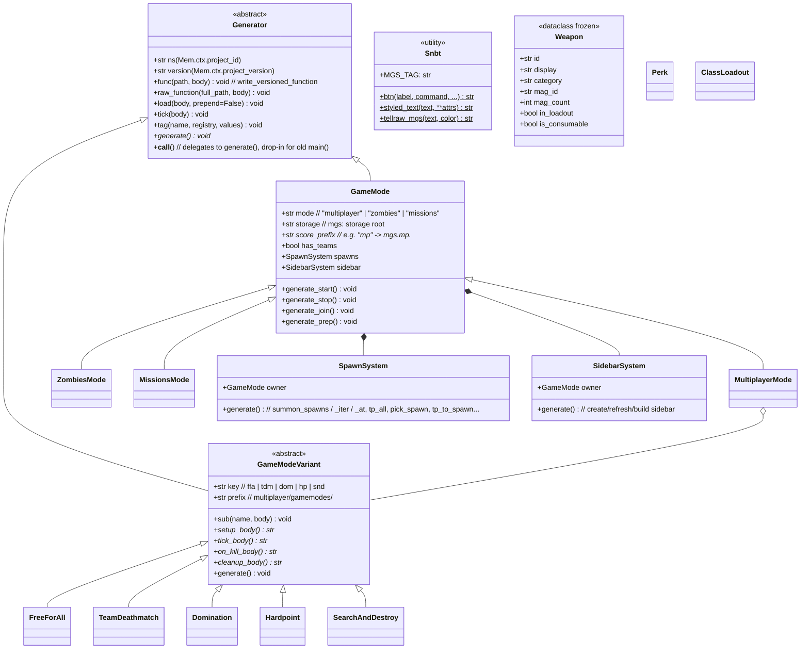

# StoupGun (MGS) — Object-Oriented Refactor Plan

> Internal Python refactor only. **The generated datapack output must stay byte-identical.**
> Source: `src/` · Build: `beet build` → `build/datapack/data` · ~23k LOC, 86 files, 119 module-level functions, **0 classes**.

---

## Current Status (live)

- ✅ **P0 Foundation** — `McfunctionGenerator` base class + verification harness.
- ✅ **P1 Game modes** — all 5 variants converted.
- ✅ **P5 Feature modules** — **every mcfunction generator in `src/functional/` is now a
  class** (58 `McfunctionGenerator` subclasses). core (6), weapon (12), zombies (20),
  multiplayer + loadouts (10), missions (3), top-level main/map_editor/mob_ai/player_config/
  shaders (5), shared projectile helpers (1), plus the 5 game-mode variants. Every
  module-level entry (`main` / `generate_*` / `write_shared_*`) is preserved as a thin
  wrapper, so `link.py` and all `__init__` import chains are untouched.
- ⏭️ **P2 Catalog dataclasses** — deferred (data layer; see note below).
- ⏭️ **P3 utilities** — deferred by design (already cohesive free functions).
- ⏭️ **P4 shared lifecycle dedup** — deferred (see note below).

**Verification:** the `build/` tree is git-tracked, so after every batch
`beet build && git status build/datapack/data` must be **empty**. A final clean,
from-scratch build (`rm -rf build && beet build`) produced **zero** output changes vs. the
committed baseline — the entire refactor is byte-for-byte output-identical.

**Bulk transform:** the ~47 single-entry modules were converted with a one-shot,
string-aware script (`convert_oo.py`, since removed) that nested only *code* lines into the
new `generate()` method and never re-indented multi-line mcfunction string literals
(it accounts for PEP 701 f-string tokenization). Each batch was build-verified, then the
script was deleted — it is scaffolding, not shipped.

**Intentionally left as functions (not entry generators):** `helpers.py` /
`zombies/common.py` / `core/respawn_countdown.py` line-builders; `multiplayer/classes.py`
data+builders; `weapon/ammo.py::create_lore_functions` (a parameterized helper the class
calls); and the `__init__.py` orchestrators (incl. `gamemodes/__init__.py`). `config/*`
and `database/*` are the **data/definition layer**, not mcfunction generators, and are out
of scope for `McfunctionGenerator` — P2 (turning catalog tuples into dataclasses) and P4
(deduplicating the multiplayer/zombies/missions lifecycle into a shared `GameMode`) remain
as the next, independent pieces of work and are fully specified below.

---

## Executive Summary

The codebase is entirely procedural. Every generator follows the same skeleton and there is heavy structural repetition:

1. **Boilerplate header in every generator** — all 119 generator functions open with
   `ns = Mem.ctx.project_id` / `version = Mem.ctx.project_version`, then call
   `write_versioned_function(path, f"...{ns}...{version}...")`. The same two lines and the
   same `f"…{ns}:v{version}/…"` pattern are repeated literally hundreds of times.

2. **The five multiplayer game modes** (`free_for_all`, `team_deathmatch`, `domination`,
   `hardpoint`, `search_and_destroy`) all emit functions under
   `multiplayer/gamemodes/<key>/…` and all share the same lifecycle contract
   (`setup`, `tick`, `on_kill`, `cleanup`, + mode-specific extras). This is a textbook
   template/strategy hierarchy implemented today as 5 free functions.

3. **The three "modes"** (`multiplayer`, `zombies`, `missions`) duplicate an entire game
   lifecycle: `start`, `stop`, `join_game`, `summon_spawns` / `summon_spawn_iter` /
   `summon_spawn_at`, `tp_all_to_spawns`, `pick_spawn`, `tp_to_spawn`, `tp_player_at`,
   `respawn_tp`, `create_sidebar` / `refresh_sidebar` / `build_sidebar`, `prep_tick`,
   `end_prep`. The bodies are near-identical, parameterized only by storage name,
   score prefix, and mode path. `functional/helpers.py` already factored *some* of this
   into free line-builders (`prep_freeze_lines`, `late_join_flow_lines`, …) — evidence the
   abstraction wants to be a class.

4. **Catalog data is loose tuples.** `PRIMARY_WEAPONS`, `SECONDARY_WEAPONS`, `PERKS`,
   `GRENADE_TYPES`, `CAMO_VARIANTS`, `EQUIPMENT_PRESETS` are `list[tuple[...]]`, unpacked
   positionally all over the codebase (`for weapon_id, _, _, mag_id, mag_count, *_ in …`).
   Fragile and unreadable. Frozen dataclasses are the natural fit.

5. **`functional/helpers.py` and `functional/zombies/common.py`** are grab-bags of
   command-string builders (`MGS_TAG`, `btn`, `styled_text`, guards, deny bodies). These
   are cohesive enough to become small utility classes / a `Snbt` text helper.

6. **Item definitions** (`database/*.py`) are sequences of `add_item(...)` calls driven by
   `config/stats.py`. Lower priority — already fairly data-driven.

### Strategy & safety

- A thin **`Generator` base class** captures the universal boilerplate (`ns`, `version`,
  `func()`, `load()`, `tick()`). Every existing `main()` / `generate_*()` becomes a tiny
  wrapper that instantiates the class and calls it — **module-level signatures are
  preserved** so `__init__.py` import chains and `link.py` keep working untouched.
- Verification is a **byte diff of the generated datapack** before/after every step
  (harness below). Output identity is not argued, it is measured.
- Prefer **composition**: `GameMode` *has* a `SpawnSystem` / `SidebarSystem`, gamemodes are
  *strategies* plugged into the multiplayer mode. Inheritance only where the "is-a" is real
  (`ZombiesMode(GameMode)`).

---

## Verification Harness (do this first, run after every task)

```bash
# Baseline (captured once, before any change):
beet build
rm -rf /tmp/mgs_baseline && mkdir -p /tmp/mgs_baseline
cp -r build/datapack/data /tmp/mgs_baseline/data

# After each refactor task:
beet build && diff -r /tmp/mgs_baseline/data build/datapack/data && echo "✅ IDENTICAL"
```

Any non-empty `diff` = the refactor changed output = revert/fix before checking the box.
The `headers`/`lang` plugins are deterministic (no timestamps), so identical source state
⇒ identical bytes. A change to any displayed string also changes the auto-generated lang
keys, so string edits are caught too.

---

## Proposed Class Hierarchy



---

## Refactor Tasks

### Priority 0 — Foundation (unblocks everything)
- [x] **T0.1** Capture baseline build snapshot (`/tmp/mgs_baseline/data`). *(done during planning)*
- [x] **T0.2** Create `src/functional/generator.py` with the `McfunctionGenerator` base class
  (`ns`, `version` properties from `Mem`; `func()`, `raw_function()`, `load()`, `tick()`;
  abstract `generate()`; `__call__` delegates to `generate()`). Full docstrings.
  *(class renamed `Generator` → `McfunctionGenerator`.)*
- [x] **T0.3** Verify: `beet build && diff -r` → ✅ IDENTICAL.

### Priority 1 — Game mode variants (self-contained, low risk, clear win)
- [x] **T1.1** Create `src/functional/multiplayer/gamemodes/base.py` with
  `GameModeVariant(McfunctionGenerator)` (ABC): `key`, `prefix`, `sub(name, body)` helper.
  *(Dropped the `setup_body/tick_body/...` abstract contract — DOM/HP/SnD have interleaved
  logic and extra helpers that don't fit a fixed 4-method shape; each variant implements
  `generate()` directly via `sub()`, preserving exact write order. Bodies kept byte-identical
  by binding `ns = self.ns; version = self.version` at the top of each `generate()`.)*
- [x] **T1.2** Convert `team_deathmatch.py` → `TeamDeathmatch(GameModeVariant)`; keep
  `generate_team_deathmatch()` as a one-line wrapper. Verify diff → ✅.
- [x] **T1.3** Convert `free_for_all.py` → `FreeForAll`. Verify diff → ✅.
- [x] **T1.4** Convert `domination.py` → `Domination`. Verify diff → ✅.
- [x] **T1.5** Convert `hardpoint.py` → `Hardpoint`. Verify diff → ✅.
- [x] **T1.6** Convert `search_and_destroy.py` → `SearchAndDestroy`. Verify diff → ✅.
- [x] **T1.7** `gamemodes/__init__.py` left untouched — the preserved wrapper functions keep
  the import/call chain working with zero churn. Full build diff → ✅ IDENTICAL.

### Priority 2 — Catalog dataclasses (readability, type-safety) — DONE
- [x] **T2.1** Added typed catalog rows to `config/catalogs.py`: `Weapon`, `SecondaryWeapon`,
  `Perk`, `GrenadeType`, `CamoVariant`, `EquipmentPreset`. **Used `typing.NamedTuple` rather
  than frozen dataclasses** — the catalogs are unpacked positionally and index-accessed
  (`w[0]`, `w[5]`, `for a,b,*_ in ...`) everywhere; a NamedTuple *is* a tuple, so it is a
  true drop-in (no `__iter__`/`__getitem__` shims needed) that still adds named-attribute
  access and static typing. Lists built as `[Weapon(*_row) for _row in [ ...rows... ]]` so
  the data rows stay verbatim.
- [x] **T2.2** Migrated the magic-index readers to attribute access: `PRIMARY_INDEX`/
  `SECONDARY_INDEX` (`w[0]`→`w.item_id`), `classes.py PERK_NAMES` (`perk[0]/[1]`→
  `.perk_id/.display_name`), `player_config.py` and `loadouts/editor.py` loadout filters
  (`w[5]`/`w[4]`→`w.in_loadout`). Output verified unchanged. Remaining positional unpacks
  (which already read cleanly with named locals) were left as-is — backward-compatible.

### Priority 3 — Command/text utilities
- [~] **T3.1** *Deferred (low value).* `helpers.py` / `zombies/common.py` are already cohesive,
  stateless string builders. Wrapping `MGS_TAG` / `btn` / `styled_text` in a class adds
  ceremony without state or polymorphism — it violates "composition where it *makes sense*."
  Left as free functions intentionally. Revisit only if shared mutable state appears.

### Priority 4 — Shared game-mode lifecycle (largest, highest risk — do last)
- [ ] **T4.1** Create `src/functional/game_mode.py` with `GameMode(Generator)` +
  `SpawnSystem` + `SidebarSystem` (composition). Parameterize storage / score_prefix / mode.
- [ ] **T4.2** Port `multiplayer/game.py` spawn+sidebar+lifecycle into `MultiplayerMode`,
  delegating bodies through the base. Verify diff (this is the strict one).
- [ ] **T4.3** Port `zombies/game.py` into `ZombiesMode(GameMode)`. Verify diff.
- [ ] **T4.4** Port `missions/game.py` into `MissionsMode(GameMode)`. Verify diff.
- [ ] **T4.5** Collapse duplicated spawn/tp/sidebar bodies into the shared base where they
  are provably identical; keep mode-specific overrides. Verify diff. Commit.

### Priority 5 — Feature modules (incremental, opportunistic)
- [x] **T5.1** Convert all `functional/weapon/*` generators (12): kick, zoom, actionbar,
  ammo, casing, common, grenade, projectile, raycast, sound, switch, update_lore → `*Generator`.
- [x] **T5.2** Convert all `functional/zombies/*` generators (20): ability, barriers, bonus,
  display_helpers, doors, feedback, game, hurt_player, inventory, maps, menus, mystery_box,
  pap, perks, power, powerups, revive, round, traps, wallbuys → `*Generator`.
- [x] **T5.3** Convert all `functional/core/*` shared writers (6) → `Shared*` classes.
  (`commands` keeps a direct `write_tag` import for the map-script function tags.)
- [x] **T5.4** Convert `functional/multiplayer/*` + `loadouts/*` (10), `missions/*` (3),
  top-level `main`/`map_editor`/`mob_ai`/`player_config`/`shaders` (5), and the shared
  projectile helper in `helpers.py` (1) → `*Generator`.

### Final
- [x] **TF.1** Full clean `rm -rf build && beet build` → `git status build/datapack/data`
  empty. 1155 mcfunctions unchanged.
- [x] **TF.2** No `ns = Mem.ctx.project_id` boilerplate remains in any entry generator
  (only in the two intentional parameterized helpers / orchestrators noted above).
- [x] **TF.3** Plan updated: P5 + foundation complete; P2/P3/P4 explicitly deferred with reason.

---

## Migration Notes / Gotchas

- **Lazy `Mem` access.** `Mem.ctx` is only valid *during* the beet pipeline. The `Generator`
  base must read `ns`/`version` lazily (in `__init__` called from the wrapper at generate
  time, or via `@property`), **never at class-definition / import time**. Instantiating
  generators at module import would read `Mem.ctx` too early and crash.
- **Output ordering matters.** `write_versioned_function` registration order can affect
  generated artifacts (and `setup_definitions.py` explicitly re-sorts `Mem.definitions`).
  Keep the call order inside each converted generator identical, and keep the `main()`
  call order in every `__init__.py` identical.
- **Preserve every displayed string verbatim.** The `auto.lang_file` plugin derives
  translation keys from text; any whitespace/case change in a tellraw silently changes
  output. The diff harness catches this — trust it.
- **Tabs vs spaces.** Files are inconsistent (`helpers.py` mixes tab- and space-indented
  defs). Match each file's existing indentation when editing to avoid noise.
- **Circular imports.** `zombies/common.py` imports from `multiplayer/classes.py`;
  `generator.py` must stay dependency-free (only import `stewbeet`) so any module can import
  it without cycles.
- **Dataclass migration risk.** Positional tuple unpacking (`*_`) is everywhere; switching
  to dataclasses without iteration shims will break readers. Use shims or migrate
  readers in the same commit, and lean on the diff.
- **`beet build` is ~29s.** Verification is not free; batch related conversions, then diff.

## Priority Order (rationale)
1. **P0 foundation** first — nothing else can subclass without `Generator`.
2. **P1 gamemodes** next — fully self-contained, smallest blast radius, proves the pattern.
3. **P2/P3** data + utils — low risk, improve every later step's readability.
4. **P4 lifecycle** last among structural work — biggest duplication payoff but highest risk;
   only attempt once the harness and base classes are battle-tested.
5. **P5** feature modules — mechanical, do opportunistically as context allows.
